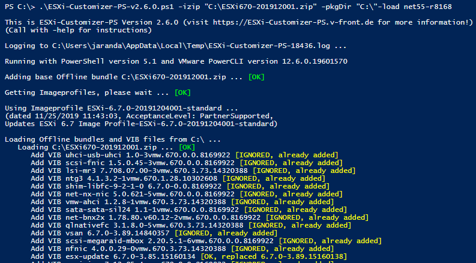
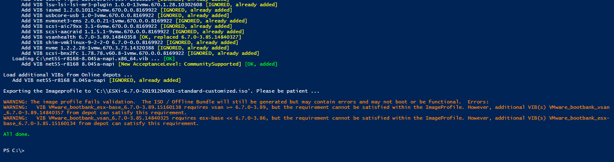

# ESXi ISO Driver Inject

```` powershell
Install-Module -Name PowerShellGet -Force
````

```` powershell
Install-Module -Name VMware.PowerCLI -Confirm:$false -Force
````

``` powershell
Set-ExecutionPolicy Unrestricted -Confirm:$false -Force
```

Go to "https://www.v-front.de/p/esxi-customizer-ps.html" download "ESXi-Customizer-PS-v2.5.1.ps1" and copy to "C:\"

Driver from "https://vibsdepot.v-front.de/wiki/index.php/List_of_currently_available_ESXi_packages"

Place ESXI Bundle ZIP and Driver VIB on C:\

``` powershell
.\ESXi-Customizer-PS-v2.6.0.ps1 -izip "C:\VMware-ESXi-7.0.3-20036589-LNV-20220714.zip" -pkgDir "C:\" -load net-r8125 -Confirm:$false -Force
```

```` powershell
PS C:\> .\ESXi-Customizer-PS-v2.6.0.ps1 -help
````



