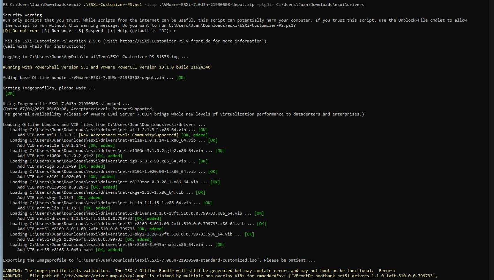

# Install Driver

Set host in maintenance mode

``` shell
esxcli software acceptance set --level=CommunitySupported
```

``` shel
esxcli software vib install -d /vmfs/volumes/datto_ssd/vib/net-atl1-2.1.3-1-offline_bundle.zip -f
```

Reboot & exit maintenance mode

Note: https://woshub.com/add-drivers-vmware-esxi-iso-image/

# Generate ISO with Drivers

``` shell	
PS C:\Users\Juan\Downloads\esxi> .\ESXi-Customizer-PS.ps1 -izip .\VMware-ESXi-7.0U3n-21930508-depot.zip -pkgDir C:\Users\Juan\Downloads\esxi\drivers
```

